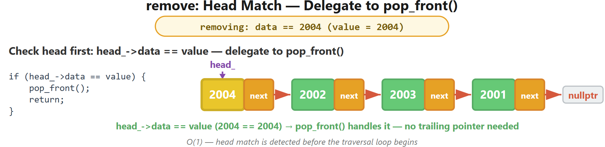
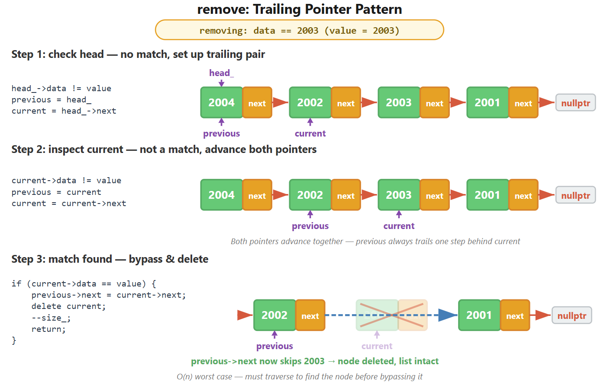

# CT8 -- Implementation Diagrams

Code-block diagrams referenced from `SinglyLinkedList.cpp`.

---

## 1. Remove Head -- Special Case
*`SinglyLinkedList.cpp::remove()` -- target is head, advance head, delete old*

---

## 2. Remove from Middle -- Trailing Pointer Bypass
*`SinglyLinkedList.cpp::remove()` -- previous->next skips over target, delete target*

