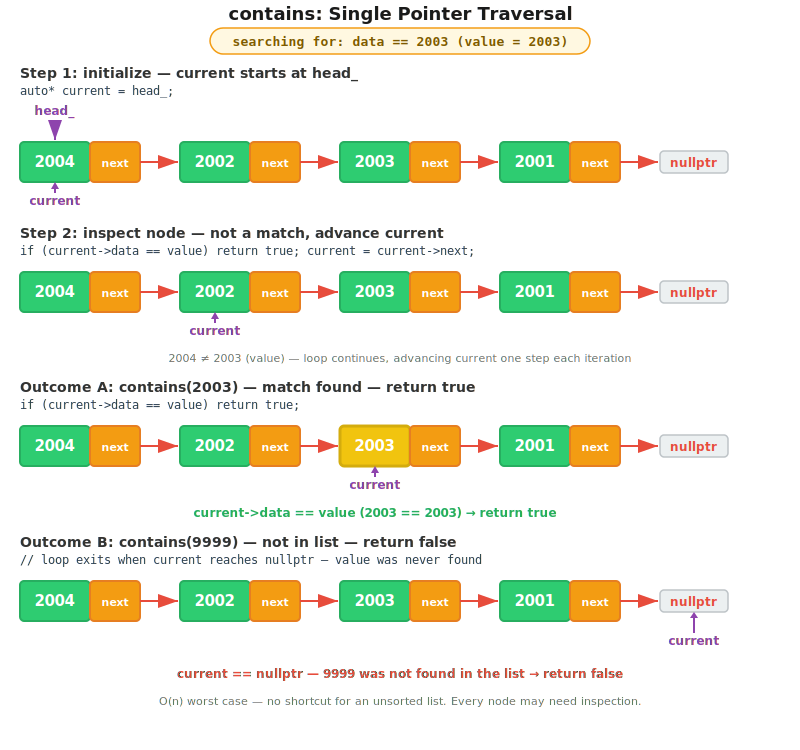
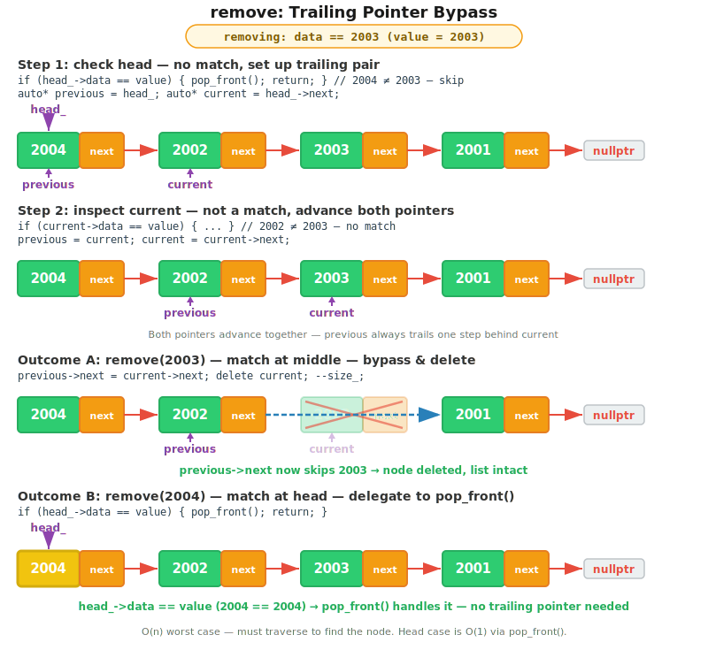

# CT8 -- Header Diagrams

Conceptual diagrams referenced from `SinglyLinkedList.h`.

---

## 1. contains -- Linear Search
*`SinglyLinkedList.h` -- walk from head comparing each node's data*

---

## 2. remove -- Trailing Pointer Pattern
*`SinglyLinkedList.h` -- find node, bypass with trailing pointer, delete*

